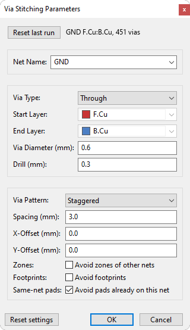

# Via Stitching

A KiCad 10 action plugin that fills the overlap of a net's copper zones (the top
and bottom GND pours, for example) with a grid of through vias, stitching the
planes together.

It's built on KiCad's IPC API (`kicad-python` / `kipy`) rather than the old SWIG
`pcbnew` bindings, so it keeps working on KiCad 11 and later, where those
bindings are gone.

## Requirements

- KiCad 10.0 or newer, with the IPC API server enabled under
  *Preferences > Plugins*.
- `kicad-python`, `wxPython`, and `shapely`, which KiCad installs for you on first
  run from `requirements.txt`.

## Install

### From the Plugin and Content Manager

*Tools > Plugin and Content Manager > Plugins*, find Via Stitching, install it,
and restart the PCB editor.

### Manually

1. Download the latest `via-stitching-x.y.z.zip` from the
   [Releases](https://github.com/jOaSbA/via-stitching/releases) page.
2. In the PCB editor: *Tools > Plugin and Content Manager > Install from File...*
   and pick the zip. You can also just unzip the `plugins/` contents into
   `Documents/KiCad/10.0/plugins/via_stitching/`.
3. Enable the IPC API server, then *Tools > External Plugins > Refresh Plugins*.

## Usage

1. Open a board and fill the zones first (`B`) so the pours have copper to read.
2. Run Via Stitching and set:
   - Via Diameter (mm) and Drill (mm) for the via size.
   - Spacing (mm) for the centre-to-centre grid pitch.
   - Net Name, the net to stitch (defaults to `GND`).
   - Pattern: Hexagonal (densest), Square, or Staggered.
3. Click OK. Vias go only where the net is poured on every layer it occupies,
   inset far enough to stay DRC-clean, and the zones are refilled for you.

### Grouping

All placed vias go into one group named `ViaStitching <net>`:

- To delete them all, click any via so the whole group selects, then `Delete`.
- To delete one, right-click a via, choose *Grouping > Remove from Group*, then
  delete it.

## How clearance is handled

There's no clearance field, on purpose. A via is placed only where it sits at
least its own radius (plus a small epsilon) inside the fill on every layer. KiCad
has already pulled the zone fill back by the board clearance, so that inset keeps
the via off other-net copper. Existing via and pad drill holes are avoided with a
0.25 mm hole-to-hole margin.

If you see "No filled copper for net ...", fill the zones (`B`) and run again.

## Building the package

Run `python build.py`. It produces `dist/via-stitching-<version>.zip` in the
layout the Plugin and Content Manager expects and writes the archive's SHA-256
and sizes into `metadata.json`.

## License

[GPL-3.0-or-later](LICENSE). Independent IPC re-implementation of the
via-stitching idea from JS Reynaud's earlier plugin.
