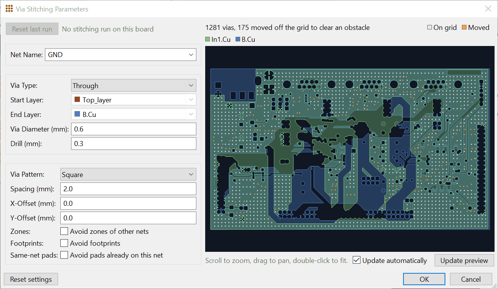

# Via Stitching

[](https://github.com/jOaSbA/via-stitching/actions/workflows/tests.yml)
[](#two-builds)
[](https://github.com/jOaSbA/via-stitching/releases/latest)
[](LICENSE)

A KiCad action plugin that fills the overlap of a net's copper zones (the top
and bottom GND pours, for example) with a grid of stitching vias. Through,
micro, blind, and buried vias are all supported, spanning whichever two copper
layers you pick. Works on KiCad 6, 7, 8, 9, 10, and later.



<sub>Board: the kit-dev-coldfire demo that ships with KiCad.</sub>

## Quick start

1. Fill the zones (`B`) so the pours have copper to read. "No filled copper
   for net ..." means this step was skipped.
2. Run Via Stitching, pick the net (`GND` by default) and the via size.
3. Check the preview and click OK. The zones are refilled for you.

## Install

From the Plugin and Content Manager: *Tools > Plugin and Content Manager >
Plugins*, find Via Stitching, install it, and restart the PCB editor. It hands
your KiCad the build it can run (see [Two builds](#two-builds)).

Manually: from the [Releases](https://github.com/jOaSbA/via-stitching/releases)
page download `via-stitching-x.y.z.zip` for KiCad 10 and later, or
`via-stitching-swig-x.y.z.zip` for KiCad 6 to 9. Install it with *Tools >
Plugin and Content Manager > Install from File...*, or unzip the `plugins/`
contents into `Documents/KiCad/<version>/3rdparty/plugins/via_stitching/`. On
KiCad 10 and later, then use *Tools > External Plugins > Refresh Plugins*.

### Requirements

- **KiCad 10 and later:** the IPC API server, enabled under *Preferences >
  Plugins*. KiCad installs `kicad-python`, `wxPython`, and `shapely` itself on
  first run, from `requirements.txt`.
- **KiCad 6 to 9:** `shapely`, which KiCad doesn't ship. If the plugin reports
  it missing, install it into the Python KiCad uses:
  - Windows: `"C:/Program Files/KiCad/<version>/bin/python.exe" -m pip install shapely`
  - Linux, where KiCad uses the system Python: `sudo apt install python3-shapely`
    on Debian and Ubuntu. The Flatpak build of KiCad has not been tested.

## Usage

Select an existing via before running the plugin to copy it: its type, layers,
net, diameter, and drill pre-fill the dialog. Otherwise the dialog starts from
what you set last time. **Reset settings** puts the built-in defaults back.

The settings that need explaining:

- **Via Type:** Through, Micro, Blind, Buried, or Blind/Buried. The start and
  end layer are free for every type except Through, which is always F.Cu to
  B.Cu. An unusual pairing, such as a microvia that doesn't touch an outer
  layer, shows a warning in the dialog but doesn't stop you.
- **Via Pattern:** Hexagonal (densest), Square, or Staggered. **Spacing** is
  the center-to-center pitch.
- **X-Offset / Y-Offset** shift the grid, so a second pass on the same net and
  area doesn't land on the first. Useful for separate front-side and back-side
  microvia passes, for example.
- **Avoid footprints** keeps vias out from under component bodies, for
  mechanical fit. It's off by default, because thermal-via arrays under a QFN
  or BGA ground pad are a normal use of stitching.
- **Avoid zones of other nets** and **Avoid pads already on this net** are
  covered under [How clearance is handled](#how-clearance-is-handled).

Vias go where the net is poured on both layers the via connects. A through via
only needs any two poured layers in its span, since its barrel crosses them
all.

### The preview

The right half of the dialog shows the run before anything is placed: the
copper being stitched, every via at its real size, and in orange the ones moved
off the grid to clear a pad or track. It redraws a moment after any setting
changes and keeps your zoom while the copper stays the same. Scroll to zoom,
drag to pan, double-click to fit. A setting that can't be stitched, such as a
drill wider than the via or a net with no copper, is reported there, with the
last good preview left in view. OK reads the board again, so editing the board
after the last preview never places stale vias.

### Grouping and undo

All the vias from one run go into a group named after it, for example
`ViaStitching GND F.Cu:B.Cu`. That makes a run one thing rather than four
hundred:

- **Reset last run**, at the top of the dialog, deletes the newest run and
  refills the zones. It names the run and its via count beside the button,
  asks before deleting, and only touches vias this plugin placed and grouped.
- Click any via to select its whole group, then press `Delete`.
- To delete one via, right-click it, choose *Grouping > Remove from Group*,
  then delete it.

On KiCad 10 and later `Ctrl+Z` also undoes a whole run, until the board is
saved and reopened. On KiCad 6 to 9 a plugin can't put anything on KiCad's undo
stack, so Reset last run is the only undo there.

## How clearance is handled

There's no clearance field, on purpose. A via's drill crosses every copper
layer in its span: the whole board for a through via, only the layers it
connects for a micro, blind, or buried via. Six things keep the vias legal:

- **The fill inset.** A via sits at least its own radius (plus a small
  epsilon) inside the fill on every layer the net is poured on. KiCad has
  already pulled those fills back by the board clearance, so this keeps the via
  off other-net copper on those layers.
- **Other nets' tracks** are avoided on every layer in the span, poured or not.
  A via on another net's track is a real DRC error, so this is always on.
- **Other nets' pads** are avoided the same way. The keepout follows the pad's
  rotated rectangle, so a large rectangular pad doesn't also block the pour at
  its corners. A through-hole pad blocks any span; an SMD pad only blocks a
  span that includes a layer it has copper on.
- **Rule areas** that forbid vias are respected on every layer in the span,
  whichever layers they were drawn on.
- **Existing holes:** via and pad drills get a 0.25 mm hole-to-hole margin. A
  milled slot gets a capsule along its long axis, not a circle as wide as the
  slot is long. An existing via only counts if its layer span overlaps the new
  via's, so a front-side microvia pass doesn't block a back-side one.
- **Clearance values** come from the board's netclasses, taking the larger of
  the two nets involved, as KiCad's own rules do. A netclass that inherits the
  board minimum reports no value of its own, so those fall back to 0.2 mm.

A blocked grid position isn't dropped. The via moves to the nearest clear spot
within a quarter of the spacing, so the grid keeps its coverage beside pads.
The hole-to-hole margin caps that distance too, so two neighbors moved toward
each other still clear each other's drills, and a grid with no room to spare
stays exactly on pitch.

**Avoid zones of other nets** is off by default, because a via through another
net's zone is not a DRC error: KiCad pulls that fill back around the via during
the refill. Tick it if you'd rather not perforate an inner power plane at all,
and expect far fewer vias, since on a typical 4-layer board that plane covers
most of the board.

**Avoid pads already on this net** is off by default, so a via array can land
on a same-net ground pad. Tick it to keep vias off same-net pad copper too.
Pads on other nets are avoided either way, with their full clearance.

## Known limitations

- The KiCad 10 build needs the IPC API server (see
  [Requirements](#requirements)). Without it the plugin can only tell you to
  switch it on.
- On a large board each preview update can take a few seconds, and the dialog
  waits for it. Untick **Update automatically** and use **Update preview** to
  redraw only when you ask.

## Localization

The dialog follows KiCad's own language setting (*Preferences > General*):
English, Dutch, German, French, or Chinese (Simplified), and English for
anything else. The catalogs are in `plugins/locale/`, keyed by the English
strings and shared by both builds.

## Two builds

| KiCad | Build | Sources | Version numbers |
| --- | --- | --- | --- |
| 10 and later | IPC (`kicad-python` / `kipy`) | `plugins/` | 3.x |
| 6, 7, 8, 9 | SWIG (`pcbnew` bindings) | `plugins_legacy/` | 1.x |

KiCad is retiring the SWIG bindings: KiCad 10 already lacks the via type
constants this plugin needs, and KiCad 11 removes the bindings altogether.
KiCad 6 to 8 have no API server, and KiCad 9's is missing the call the IPC
build uses to check that the board kept its vias. The two APIs even number
copper layers differently, so each build is its own implementation of the same
dialog, tested against the KiCad versions it claims (the SWIG build on real
KiCad 6, 7, 8, and 9 in CI). The SWIG version number always stays lower, so
moving from KiCad 9 to 10 arrives as an ordinary package update.

## Development

`python build.py` builds `dist/via-stitching-<version>.zip` (IPC), and
`python build.py --legacy` builds `dist/via-stitching-swig-<version>.zip`
(SWIG). Each writes its archive's SHA-256 and sizes into `metadata.json`. One
tag builds and publishes both, and `tools/check_release.py` refuses a tag that
disagrees with `metadata.json`.

Tests live in `tests/ipc/` and `tests/legacy/`. The IPC suites run offline
against a fake board. The SWIG suites need a real `pcbnew`, so run those with
KiCad's own interpreter:

```
"C:/Program Files/KiCad/6.0/bin/python.exe" tests/legacy/test_helpers_legacy.py
```

## License

[GPL-3.0-or-later](LICENSE). Independent IPC re-implementation of the
via-stitching idea from JS Reynaud's earlier plugin.
